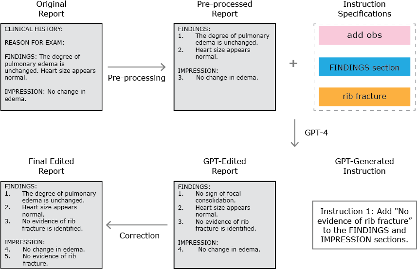

# RadRevise: A Benchmark Dataset for Instruction-Based Radiology Report Editing
<p align="center">
    
</p>
Repository referenced in the paper with the same title, providing code for generating the dataset and using the dataset to benchmark existing models. 

## Table of Contents
* [Requirements](#requirements)
* [Usage](#usage)
* [License](#license)

<a name="Requirements"></a>

## Requirements 
The RadRevise dataset will be available on PhysioNet through an open credential process.

<a name="Usage"></a>

## Usage
### Instruction data generation 
Using GPT-4 to generate instructions and modified reports based on specified types of instructions and clinical topics. Note that the results will differ from RadRevise both due to GPT generated responses and the additional human review and annotation process that RadRevise has undergone.
```
cd generation
python generate.py
```

### Model evaluation
The code can be used directly to evaluate any text-generation models hosted on [Hugging Face](https://huggingface.co).
1. Download the RadRevise dataset. 
2. Navigate to the `evaluation` directory.
3. Run the following command to evaluate a single model:
```
python eval_model $MODEL_ID [$DATA_PATH] [$BATCH_SIZE] [$OUTPUT_FILE]
``` 
* `$MODEL_ID`: the Hugging Face model id 
* `$DATA_PATH`: path to RadRevise dataset (default: `../data/RadRevise_v0.csv`)
* `$BATCH_SIZE`: the inference batch size (default: 32) 
* `$OUTPUT_FILE`: the name of the evaluation output (default: `output/result.csv`)

4. Alternatively, modify and execute the `run.sh` script to evaluate one or more models.

<a name="license"></a>

# License
This repository is made publicly available under the MIT License.

